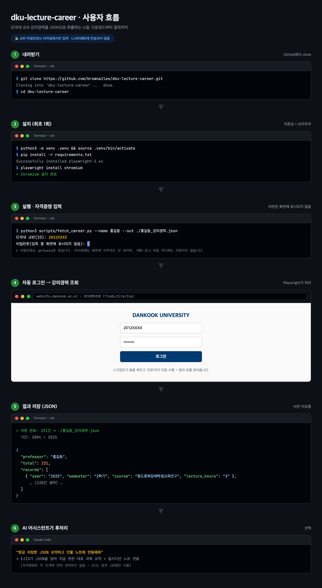

# dku-lecture-career

단국대학교 webinfo 포털의 **강의경력조회(`findLctCrerInq`)** 표를 파싱해 JSON으로 저장하는 작은 도구입니다. Playwright로 로그인 후 강의경력 페이지를 조회하고, 표를 구조화된 JSON으로 떨굽니다.

## 사용자 흐름



내려받기 → 설치 → 실행(교번·비번 터미널 입력) → 자동 로그인·조회 → JSON 저장. 비밀번호는 3단계에서 터미널로만 입력되며 이후 어떤 단계에도 노출되지 않습니다.

## 🔐 보안 설계

- **교번·비밀번호는 터미널에서 직접 입력**받습니다(`getpass`). 명령행 인자나 대화형 AI에 넣지 않습니다.
- 비밀번호는 메모리에서만 쓰이고 **사용 직후 폐기**됩니다. 출력 JSON·표준출력·로그 어디에도 남지 않습니다.
- 교번은 기본 출력에서 제외됩니다(`--keep-id`로만 포함).

> AI 어시스턴트(예: Claude Code)와 함께 쓸 때도, **스크립트는 사용자가 직접 터미널에서 실행**하세요. 그래야 자격증명이 대화 기록에 남지 않습니다.

## 전제

- '강의경력조회' 메뉴는 **교수(전임) 계정**에서만 보입니다. **강사 계정에는 없습니다.**
- 단국대 구성원 본인 계정으로 본인 강의경력을 조회하는 용도입니다.

## 설치

```bash
git clone https://github.com/brownailes/dku-lecture-career.git
cd dku-lecture-career
python3 -m venv .venv && source .venv/bin/activate
pip install -r requirements.txt
playwright install chromium
```

## 사용

```bash
python3 scripts/fetch_career.py --name 홍길동 --out ./홍길동_강의경력.json
```

실행하면 터미널이 교번과 비밀번호를 물어봅니다(비번은 화면에 표시되지 않음). 로그인 후 강의경력을 조회·파싱해 JSON으로 저장합니다.

| 옵션 | 설명 |
|------|------|
| `--out PATH` | 출력 JSON 경로 (기본 `dku_lecture_career.json`) |
| `--name NAME` | 교수명(출력 라벨, 선택) |
| `--headless` | 브라우저 창 숨김 (기본은 창 표시) |
| `--keep-id` | 출력 JSON에 교번 포함 (기본 미포함) |

비대화 환경에서만, 환경변수 `DKU_ID` / `DKU_PW`로 입력을 대신할 수 있습니다(평문 노출에 주의).

## 출력 예시

```json
{
  "professor": "홍길동",
  "source": "단국대학교 webinfo 강의경력조회 (findLctCrerInq.do)",
  "extracted_at": "2026-06-17",
  "total": 231,
  "records": [
    {"no":1,"year":"2025","semester":"2학기","institution":"단국대학교",
     "department":"교육대학원","position":"교수","course":"중도중복장애학생교육연구",
     "start_date":"2025-09-01","end_date":"2026-02-28","lecture_hours":"3"}
  ]
}
```

## 페이지 구조가 바뀌면

`scripts/fetch_career.py`의 셀렉터를 갱신하세요.
- 로그인: `#user_id`, `#user_password`, `button[onclick*='doLogin']`
- 강의경력: 조회 버튼 `a:has-text('조회')`, 헤더에 `년도`·`담당과목`을 가진 `<table>`

## 라이선스

MIT License. 본 도구는 본인 계정 데이터 조회 자동화를 목적으로 하며, 사용에 따른 책임은 사용자에게 있습니다. 대상 사이트의 이용약관을 준수하세요.
